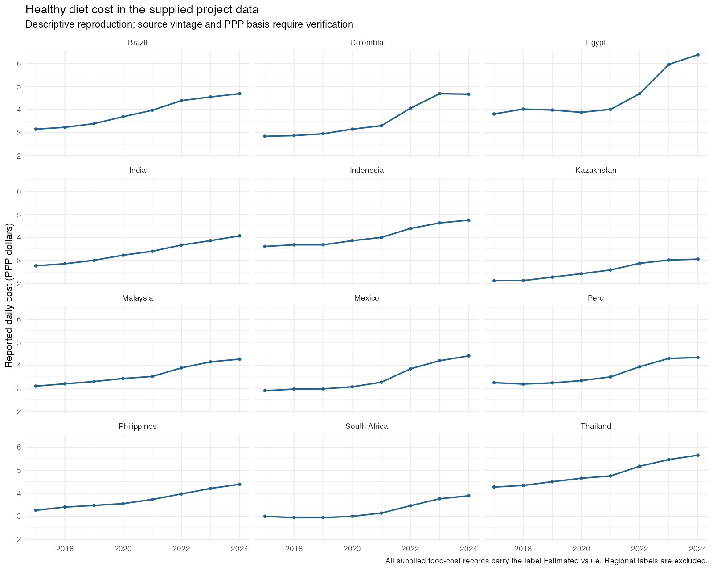

# Healthy diet costs and macroeconomic indicators

**Ruoxi (Rachel) Liu | Summer project June–August 2026 | Reproducibility revision September 2026**

An R workflow for joining country-year diet-cost records to macroeconomic indicators and auditing the resulting panel. The original progress report is dated July 20, 2026. The current portfolio version reproduces the selected sample and adds source-quality checks and trend visualization.

## Scope and verified output

- Reconstructs a balanced **12-country, 96-observation panel for 2017–2024**.
- Summarizes diet cost and seven macroeconomic indicators, with 96 nonmissing observations per selected variable.
- Checks duplicate country-year keys, join success, date coverage, and regional labels.
- Produces descriptive tables, country trends, and an audit trail.



## Important data findings

The supplied food-cost file contains 1,379 records, all labeled `Estimated value`. **11 of the 12 selected countries have incorrect regional labels** in that file; for example, Brazil is labeled Africa and India Americas. The analysis excludes this region field and records discrepancies explicitly in `results/region_audit.csv`. Original data are not silently overwritten.

The precise source download, release vintage, and PPP reference basis were not preserved in the supplied package. Numerical results are therefore a reproduction of the supplied data, not independently authenticated official estimates. Current official figures may differ due to revisions. Annualized costs are not used because their name suggests USD even though they appear derived from PPP-denominated daily costs.

The 12-country sample comes from the original progress report; it is not a representative global sample. GDP-deflator inflation is not a food-price inflation measure. Raw exchange-rate levels have country-specific currency units and their pooled average has little economic meaning; it is retained only to reproduce the original descriptive table.

## Reproduce

From the repository root, with R 4.5 or later:

```r
source("scripts/setup.R")
source("scripts/run_analysis.R")
```

Place `price_of_healthy_diet_clean.csv` and `world_bank_indicators.csv` in `data/`. These are the exact filenames supplied with the original project. Raw input files are available in the local package and excluded from Git tracking; an exact public download link for the original cleaned food file remains to be established. Without those files, the published code can be reviewed but the original results cannot yet be independently regenerated from a public source alone.

Potential primary sources for verification:
- [World Bank Food Prices for Nutrition](https://www.worldbank.org/en/programs/icp/brief/foodpricesfornutrition)
- [World Bank Food Prices for Nutrition data catalog](https://datacatalog.worldbank.org/search/dataset/0061222/food-prices-for-nutrition-fpn)
- [World Development Indicators](https://databank.worldbank.org/source/world-development-indicators)

## Why there is no causal estimate

The source folder is named CausalInferenceFinalProject, but the supplied report implements merging and descriptive statistics only. It does not specify treatment assignment, an intervention date, a causal estimand, or an identification strategy. This repository therefore makes **no claim to have estimated a causal effect**. A policy evaluation would require those ingredients, source verification, and appropriate design diagnostics before choosing a model.

## Revision record

The July 2026 work supplies the selected countries, join, and descriptive analysis. The September 21, 2026 revision adds a standalone script, explicit validation, region audit, trend figure, source caveats, and reproducible outputs with AI assistance. The original summer project dates are retained, while the new work is dated separately.

## Next steps

1. Recover the original food-cost source and methodology, including PPP vintage.
2. Reconcile the selected records with the appropriate official release.
3. Document how country selection was determined and test broader coverage.
4. Define a substantive question before adding regression or causal inference.
